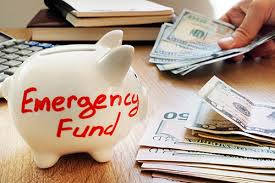

# Class Notes 004

# [Emergency Fund](https://www.consumerfinance.gov/an-essential-guide-to-building-an-emergency-fund/): What It Is and Why It Matters

## What is an emergency fund?

An emergency fund is a savings account that you set aside for unexpected expenses. such as: unforeseen medical bills, car repairs, or job loss.

## Why do I need an emergency fund?
It's important to have an emergency fund because it can help you avoid going into debt or having to take out a loan or use your credit card to cover unexpected expenses.

## How much should I save?
You should aim to have more than $500 in your emergency fund. To cover an important Expense. But if you can save more, that's even better. the recommended amount is three to six months of your living expenses.

## Where do I put my emergency fund?
For your emergency fund, you should choose a savings account that is easy to access and has a low-interest rate. Like a high-yield savings account or a money market account.