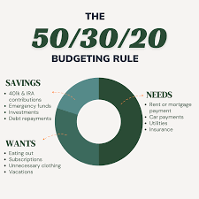
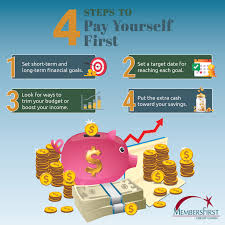
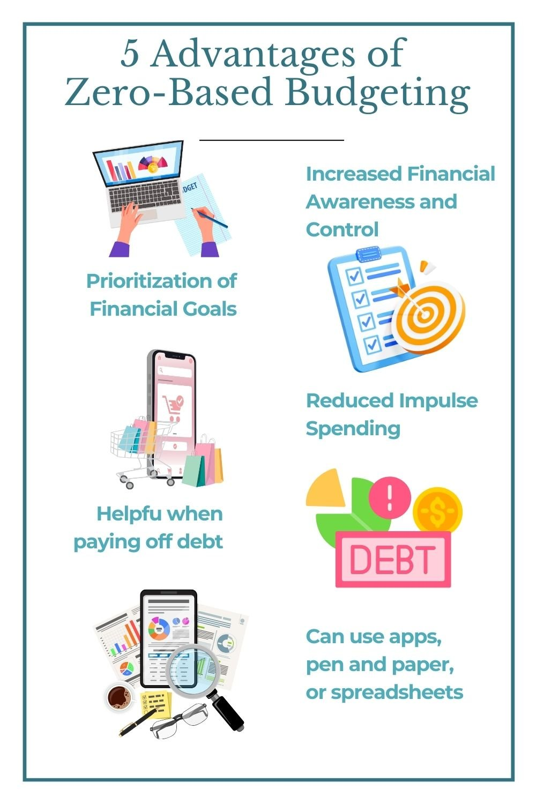
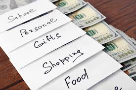

# Class Notes 005

# 4 Budgeting Strategies: Which one is right for you?

## 50/30/20 budget method

The 50/30/20 budget method is a simple way to budget your money. It involves dividing your income into three categories: 50% for needs, 30% for wants, and 20% for savings. This method is easy to follow and can help you stay on track with your financial goals.

## Pay yourself first budget
The pay yourself first budget is a budgeting method that involves setting aside a certain percentage of your income before you spend any money on other expenses. This method is designed to help you save money and reach your financial goals.

##  Zero-based budget
The zero-based budget is a budgeting method that involves starting with zero and then allocating funds to each expense category. This method is designed to help you track your spending and stay within your budget.

## Envelope budgeting method
The envelope budgeting method is a budgeting method that involves using physical envelopes to track your spending. Each envelope is labeled with a different expense category, such as groceries, entertainment, or rent. This method is designed to help you stay on track with your budget and avoid overspending.

